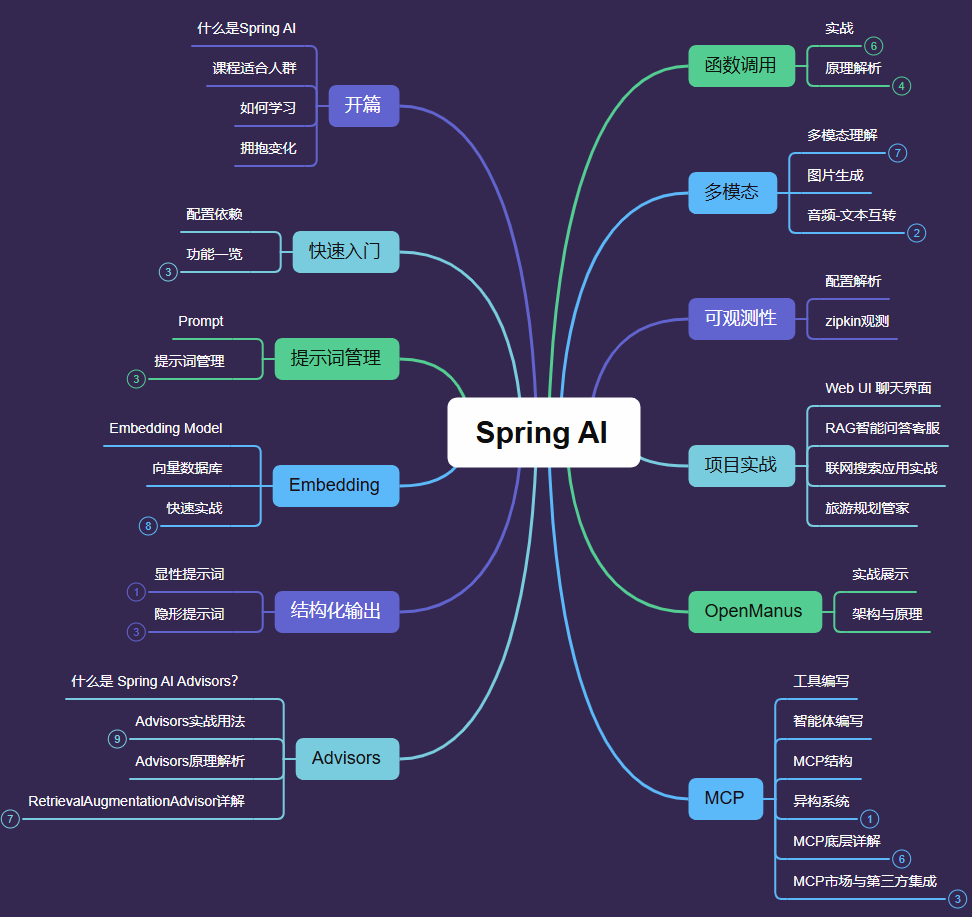

# Spring AI 通关秘籍

欢迎来到[《Spring AI 通关秘籍》](https://www.xiaobot.net/p/SpringAI?refer=c6fd3e66-9981-4d70-957d-7d758e6e23e6)专栏的 GitHub 仓库！这里包含了我在专栏课程中讲解的核心代码，目的是帮助你更好地理解和掌握 Spring AI 框架的精髓。专栏中的内容从零基础入手，循序渐进地介绍如何将 AI 技术应用到 Spring 开发中，结合实际项目，带你一步步掌握这个强大的工具。



项目代码也会随着Spring AI 版本的更新而更新，以适应最新的 Spring AI 版本和开发需求。如果觉得有所帮助，就点一个star吧！

## 快速开始

1. 克隆这个仓库到本地：
   ```bash
   git clone https://github.com/StudiousXiaoYu/spring-ai-courses.git
   ```

2. 根据课程模块目录结构，逐一学习每个模块的源码，并参考专栏中的讲解进行开发和实践。

3. 在专栏中找到更多项目实战和进阶内容，不断提升自己的开发技能，迈向更高水平的 AI 开发！

## 课程模块源码

这个仓库包含了专栏中各个模块的源码，帮助你深入学习每个环节的内容，快速上手 Spring AI。具体的课程模块包括：

- **01-course-quickstart**: 快速入门，带你搭建 Spring AI 开发环境，快速了解框架基础。
- **02-course-prompt**: 了解如何高效地与 AI 进行交互，掌握 AI 提示工程的核心技能。
- **03-course-output**: 学习如何处理 AI 输出，并实现更加智能的交互功能。
- **03-course-image_audio**: 涉及图像和音频处理，展示如何将多媒体功能集成到 Spring AI 应用中。
- **04-course-embedding**: 讲解如何使用 Spring AI 进行高效的文本和数据嵌入。
- **05-course-advisor**: 理解 AI 在智能系统中的应用，并学习如何创建智能顾问系统。
- **06-course-document**: 实战操作，处理和解析文档数据，提升开发效率。
- **07-course-function-call**: 深入探讨如何在 Spring AI 中实现的函数调用和数据交互。

通过这些模块，你不仅可以掌握 Spring AI 框架的使用技巧，还能深入理解 AI 的工作原理，并学会如何将其应用到实际业务中。

## 专栏特色

《Spring AI 通关秘籍》专栏的最大特点是注重实践和项目驱动，课程内容包括了大量的代码示例、解读与实际案例。无论你是初学者还是已有一定开发经验的工程师，这里都会给你提供有力的支持，帮助你快速提升技能：

- **零基础起步**：从最基础的知识讲解开始，逐步深入到高级应用，帮助你打下坚实的基础。
- **项目实战**：通过实战项目，带你领略如何将 AI 融入到实际开发中，解决工作中的实际问题。
- **源码解析**：每个模块的源码都有详细的解析，帮助你理解每一行代码背后的思想。
- **高效学习**：通过视频、文档、源码等多种形式的学习资源，快速提升开发技能。

## 未来更新

除了上述模块外，我还会不断更新更多实战项目源码。这些实战项目将帮助你在不同的业务场景中应用 Spring AI，但请注意，这些项目源码将不会开源，而是会通过网盘形式在专栏内分享，仅限付费用户查看。

## 如何获取源码

- **公开源码**：上面提到的这些模块源码都将公开，供大家在 GitHub 上下载和使用。
- **付费专栏内容**：更多实战项目源码和进阶内容将通过专栏内的网盘链接提供，需订阅专栏以获取完整的资源。

## 小惊喜

《Spring AI 通关秘籍》专栏不仅是一次技术的学习，更是一次与 AI 共同成长的旅程。如果你想通过 Spring AI 框架更好地将 AI 融入你的项目中，提升开发效率，欢迎加入专栏，一起开启这段充满挑战与机会的探索之旅！

希望这个 GitHub 仓库能成为你学习过程中的重要参考，祝你学习愉快，开发顺利！

恭喜你发现了一张5折优惠卷，数量有限，领完为止：https://www.xiaobot.net/coupon/c61bece3-5533-4f07-97bc-d9d9c055995c